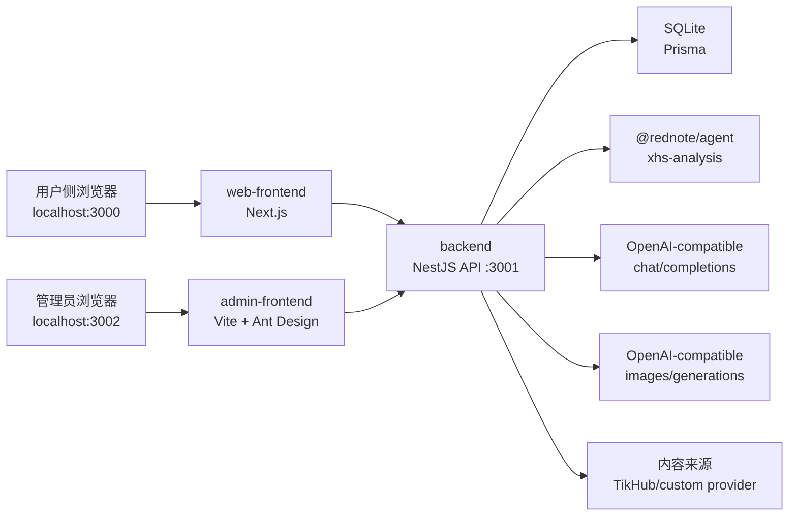
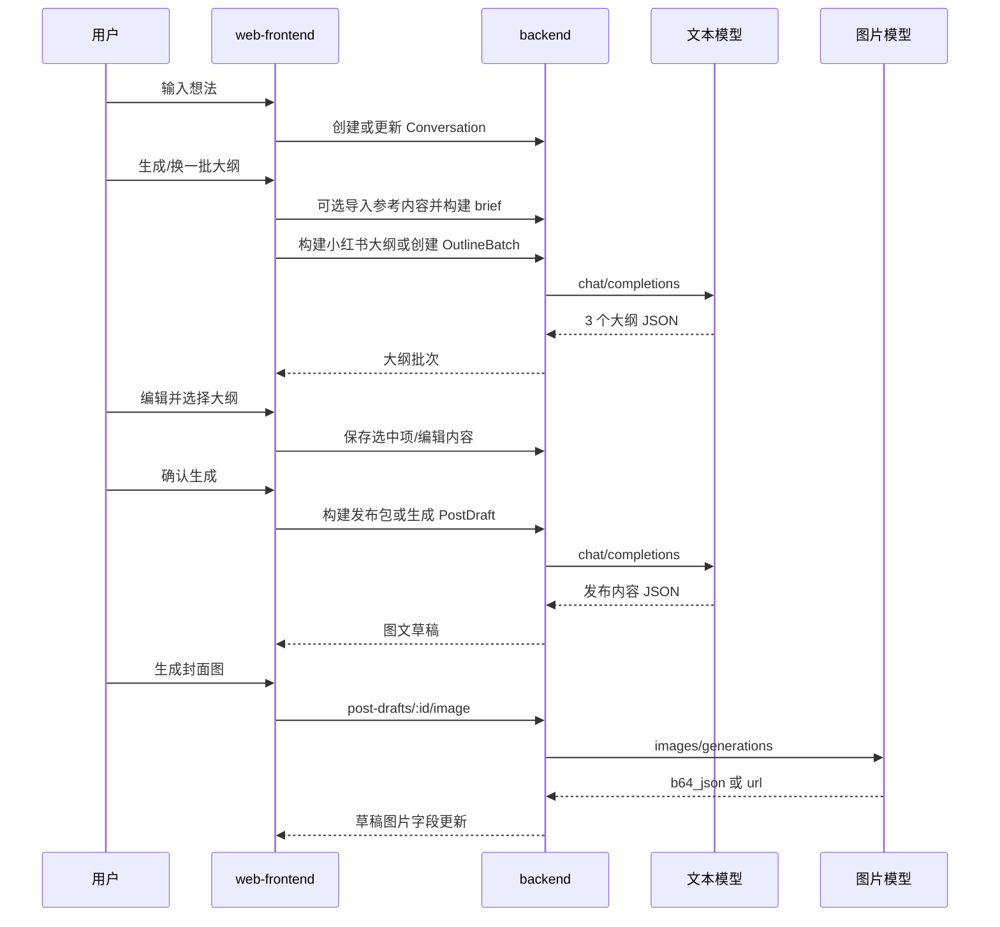

# RedNote 当前项目设计文档

更新日期：2026-06-12

## 1. 项目定位

RedNote 是面向小红书内容创作者、运营人员、个人博主和内容团队的 AI 创作工作台。核心目标是把一句模糊想法转成多个可比较、可编辑的大纲，再基于用户选定的大纲生成可直接复制发布的小红书图文内容。

当前产品已经从单页工作台扩展为一个 monorepo 系统，包含：

- 用户侧创作工作台。
- NestJS 后端 API。
- 可复用的 `@rednote/agent` 分析与生成辅助包。
- 管理后台，包括项目管理、管理员信息、模型配置和内容来源配置。

## 2. Monorepo 结构

```text
rednote/
  package.json
  pnpm-workspace.yaml
  PRODUCT.md
  docs/
    project-design.md
    xhs-connector-analysis.md
  packages/
    agent/
    backend/
    web-frontend/
    admin-frontend/
```

### 2.1 根工作区

根 `package.json` 定义统一脚本：

- `pnpm dev`：同时启动 backend、web-frontend、admin-frontend。
- `pnpm dev:backend`：启动 NestJS 后端。
- `pnpm dev:frontend` / `pnpm dev:web`：启动用户侧 Next.js 前端。
- `pnpm dev:admin`：启动管理后台 Vite 前端。
- `pnpm test`：递归执行各包测试。
- `pnpm build`：递归构建各包。

workspace 由 `pnpm-workspace.yaml` 管理：

```yaml
packages:
  - 'packages/*'
```

### 2.2 packages/agent

包名：`@rednote/agent`

职责：

- 提供 agent runtime、工具注册、循环调用、会话与记忆相关能力。
- 不承载 backend 业务 domain，避免 backend dev 启动时跨包加载 ESM 源码。

入口：

- `src/index.ts`

当前 `package.json` 的 `main` 和 `types` 指向 `src/index.ts`，并通过 exports 暴露：

- `.`

### 2.3 packages/backend

包名：`@rednote/backend`

职责：

- NestJS API 服务。
- 用户认证、管理员认证。
- 创作工作台数据持久化。
- 文本模型和图片模型调用。
- 小红书内容分析与外部内容来源导入。
- 管理后台数据与配置。

技术：

- NestJS 11
- Prisma 6
- SQLite
- JWT
- Argon2
- class-validator

默认端口：`3001`

### 2.4 packages/web-frontend

包名：`@rednote/web-frontend`

职责：

- 用户侧创作工作台。
- 登录、注册、Google 登录、Demo 登录。
- 对话列表、新增对话、删除对话。
- 想法输入、大纲生成、换一批保留旧大纲、大纲编辑和选择。
- 导入小红书参考内容。
- 生成发布包、修复发布包、生成封面图。
- 草稿保存、自动保存、工作状态恢复。

技术：

- Next.js 16
- React 19
- Tailwind CSS 4
- lucide-react

默认端口：`3000`

### 2.5 packages/admin-frontend

包名：`@rednote/admin-frontend`

职责：

- 管理后台。
- 管理员登录、资料修改、密码修改。
- 项目总览、项目列表、任务看板、成员视图。
- 文本模型和图片模型配置。
- 内容来源配置。
- 审计日志展示。

技术：

- Vite
- React 19
- Ant Design 6
- @ant-design/icons

默认端口：`3002`

## 3. 运行时架构



后端全局启用：

- CORS，默认允许 `http://localhost:3000,http://localhost:3002`。
- ValidationPipe，开启 `transform` 和 `whitelist`。
- `ApiExceptionFilter`，错误统一返回 `{ code, data, msg }`。
- `ApiResponseInterceptor`，成功统一返回 `{ code: 0, data, msg: "ok" }`。

## 4. 数据模型

数据模型以 `packages/backend/prisma/schema.prisma` 为准。

### 4.1 用户与认证

#### User

用户侧账号。

字段：

- `account`：唯一账号，普通登录通常是邮箱。
- `displayName`：展示名。
- `passwordHash`：普通登录密码哈希，Google 用户可为空。
- `authProvider`：默认 `password`，Google 登录为 `google`。
- `googleSub`：Google 账号唯一标识。

关系：

- 一个用户有多个 `Conversation`。

#### AdminUser

后台管理员账号。

字段：

- `account`
- `displayName`
- `passwordHash`
- `lastLoginAt`

初始化逻辑：

- 后端启动时若没有管理员，则自动创建初始管理员。
- 默认账号：`admin`
- 默认密码：`Rednote@123456`
- 可通过 `ADMIN_INITIAL_ACCOUNT` 和 `ADMIN_INITIAL_PASSWORD` 配置。
- 生产环境必须配置 `ADMIN_INITIAL_PASSWORD`，否则启动会报错。

### 4.2 创作工作台

#### Conversation

一次创作对话和工作状态的根对象。

字段：

- `userId`
- `title`
- `topic`
- `selectedOutlineId`
- `statusMessage`
- `lastOpenedAt`

关系：

- `outlineBatches`
- `postDrafts`
- `savedDrafts`
- `snapshots`
- `xhsReferences`

#### OutlineBatch

一次生成出来的一批大纲。

字段：

- `conversationId`
- `batchNo`
- `prompt`

约束：

- `conversationId + batchNo` 唯一。

#### Outline

单个大纲。

字段：

- `tone`
- `label`
- `title`
- `hook`
- `points`：JSON 字符串。
- `position`

当前大纲语气主要映射为：

- `guide`
- `story`
- `checklist`

#### PostDraft

基于选中大纲生成的图文草稿。

字段：

- `title`
- `coverLine`
- `caption`
- `sections`：JSON 字符串数组。
- `tags`：JSON 字符串数组。
- `imagePrompt`
- `imageUrl`
- `imageStatus`：`idle` / `generating` / `ready` / `failed`
- `imageProvider`
- `imageError`
- `imageGeneratedAt`
- `stale`

`stale=true` 表示大纲或上下文已经变化，当前草稿可能不是最新生成结果。

#### SavedDraft

手动保存的草稿快照。

字段：

- `conversationId`
- `postDraftId`
- `snapshot`：JSON 字符串。

前端会对保存草稿做签名去重，避免重复展示完全相同的草稿。

#### ConversationSnapshot

完整工作台状态快照，用于自动保存和恢复。

字段：

- `conversationId`
- `snapshot`：JSON 字符串。

前端自动保存会将当前工作台状态写入 snapshot，包括想法、大纲、选中项、草稿、参考来源、最近工作流结果等。

#### XhsReference

导入的小红书参考来源。

字段：

- `conversationId`
- `kind`：`post` 或 `account`
- `providerType`：`tikhub` 或 `custom`
- `providerEndpoint`
- `sourceId`
- `sourceUrl`
- `title`
- `imported`：归一化导入结果 JSON。
- `analysis`：分析结果 JSON。

约束：

- `conversationId + kind + sourceId` 唯一，用于同一对话内参考来源去重。

### 4.3 管理后台

#### AdminModelConfig

模型配置。

字段：

- `type`：`text` 或 `image`
- `baseUrl`
- `modelName`
- `apiKeyEncrypted`：兼容旧配置，新版优先使用 `AdminModelApiKey`

#### AdminModelApiKey

模型 API Key 列表。

字段：

- `type`
- `name`
- `apiKeyEncrypted`
- `enabled`

运行时选择：

- 优先使用当前 type 下最早创建且 `enabled=true` 的 key。
- 若没有任何新版 key 且旧 config 中有 `apiKeyEncrypted`，则兼容使用旧 key。

#### AdminContentProviderConfig

内容来源配置。

字段：

- `type`：`tikhub` 或 `custom`
- `name`
- `baseUrl`
- `enabled`
- `rateLimitPerMinute`
- `complianceNote`

#### AdminContentProviderApiKey

内容来源 API Key 列表。

字段：

- `type`
- `name`
- `apiKeyEncrypted`
- `enabled`

运行时选择：

- 使用当前 provider type 下最早创建且 `enabled=true` 的 key。

#### AdminProject / AdminTask / AdminNotification

后台项目管理数据。

`AdminProject` 包含项目 key、名称、负责人、状态、优先级、预算、截止日期、进度、团队和风险字段。

`AdminTask` 包含任务 key、任务名、负责人、截止日期、状态和可选关联项目。

`AdminNotification` 用于后台通知列表。

#### AdminAuditLog

管理后台审计日志。

字段：

- `action`
- `targetType`
- `targetKey`
- `actor`
- `metadata`
- `createdAt`

模型配置、内容来源配置、项目和任务变更都会记录审计日志。

## 5. 后端模块设计

### 5.1 AppModule

导入模块：

- `ConfigModule`
- `AdminAuthModule`
- `AdminAuditLogsModule`
- `AdminModelConfigsModule`
- `AdminContentProvidersModule`
- `AdminProjectsModule`
- `AuthModule`
- `ConversationsModule`
- `XhsAnalysisModule`

环境文件加载顺序：

- `.env.local`
- `.env`
- `../../.env`

### 5.2 AuthModule

用户侧认证接口：

- `POST /auth/register`
- `POST /auth/login`
- `POST /auth/google`
- `POST /auth/demo`
- `POST /auth/logout`
- `GET /auth/me`

认证方式：

- 普通账号密码，密码使用 Argon2。
- Google Credential 登录，后端通过 `google-auth-library` 校验。
- 若 Google 邮箱尚未注册，则自动创建用户。
- Demo 登录非生产环境默认可用，或通过 `ENABLE_DEMO_LOGIN=true` 显式开启。

用户端 JWT payload：

```ts
{
  sub: user.id,
  account: user.account,
  name: user.displayName
}
```

### 5.3 AdminAuthModule

后台管理员接口：

- `POST /admin/auth/login`
- `GET /admin/auth/me`
- `PATCH /admin/auth/profile`
- `PATCH /admin/auth/password`

管理员 JWT payload：

```ts
{
  sub: admin.id,
  account: admin.account,
  displayName: admin.displayName,
  scope: "admin"
}
```

后台接口由 `AdminJwtAuthGuard` 保护。

### 5.4 ConversationsModule

负责创作工作台持久化和 AI 生成流程。

接口：

- `GET /conversations`
- `POST /conversations`
- `GET /conversations/:id`
- `PATCH /conversations/:id`
- `DELETE /conversations/:id`
- `POST /conversations/:id/outline-batches`
- `POST /conversations/:id/post-draft`
- `POST /conversations/:id/saved-drafts`
- `GET /conversations/:id/saved-drafts`
- `POST /conversations/:id/snapshots`
- `GET /conversations/:id/snapshots`
- `PATCH /outlines/:id`
- `GET /post-drafts/:id`
- `PATCH /post-drafts/:id`
- `POST /post-drafts/:id/image`
- `POST /snapshots/:id/restore`

核心行为：

- 创建会话时只保存 topic/title，不立刻生成内容。
- 生成大纲时，每次追加一个 `OutlineBatch`，之前批次保留。
- 新大纲生成后，旧草稿标记为 `stale=true`。
- 编辑大纲后，关联会话内草稿标记为 stale。
- 生成草稿时，使用选中大纲生成可发布内容。
- 生成封面图时，先将 `imageStatus` 置为 `generating`，成功后写入 `imageUrl`，失败后写入 `imageError`。
- 手动保存创建 `SavedDraft`。
- 自动保存创建 `ConversationSnapshot`。

### 5.5 GenerationModule

负责通过文本模型生成大纲和草稿。

运行时依赖：

- `AdminModelConfigsService.getRuntimeConfig("text")`

模型协议：

- OpenAI-compatible `POST {baseUrl}/chat/completions`
- 请求包含 `model`、`messages`、`response_format: { type: "json_object" }`、`temperature`

大纲生成要求：

- 一次返回 3 个大纲。
- 每个大纲 5 个要点。
- tone 必须是 `guide`、`story` 或 `checklist`。

草稿生成要求：

- 返回可直接发布内容。
- 字段包括 `title`、`coverLine`、`caption`、`sections`、`tags`、`imagePrompt`。
- `coverLine` 最长截取 18 个中文字符。

### 5.6 ImageGenerationModule

负责封面图生成。

运行时依赖：

- `AdminModelConfigsService.getRuntimeConfig("image")`

模型协议：

- OpenAI-compatible `POST {baseUrl}/images/generations`
- 请求包含 `model`、`prompt`、`response_format: "b64_json"`、`size: "1024x1536"`

返回处理：

- 优先读取 `data[0].b64_json`，转为 `data:image/png;base64,...`。
- 也兼容 `data[0].url`。

### 5.7 XhsAnalysisModule

负责小红书参考内容分析、导入、发布包构建和发布包修复。

接口：

- `POST /xhs-analysis/posts/analyze`
- `POST /xhs-analysis/posts/import`
- `POST /xhs-analysis/accounts/analyze`
- `POST /xhs-analysis/accounts/import`
- `POST /xhs-analysis/generation-brief`
- `POST /xhs-analysis/outlines`
- `POST /xhs-analysis/workflows/commercial-draft`
- `POST /xhs-analysis/workflows/repair-publish-package`
- `GET /conversations/:conversationId/xhs-references`
- `DELETE /xhs-references/:referenceId`

职责划分：

- `packages/backend/src/xhs-analysis/domain`：负责小红书内容分析、归一化、选题摘要、发布包生成和发布包审查等纯 domain 函数。
- backend service/controller：负责鉴权、调用外部内容来源、保存参考来源和使用模型修复发布包。

外部内容来源调用：

- 帖子导入：`POST {provider.baseUrl}/xhs/posts/import`
- 账号导入：`POST {provider.baseUrl}/xhs/accounts/import`
- 请求头：`Authorization: Bearer <apiKey>`

provider 返回会被解包：

- 支持外层 `{ data: ... }`
- 支持外层 `{ result: ... }`
- 帖子优先读取 `note`、`post`、`item`
- 账号优先读取 `account`、`profile`、`user`

### 5.8 AdminModelConfigsModule

负责后台模型配置。

接口：

- `GET /admin/model-configs`
- `PUT /admin/model-configs/:type`
- `POST /admin/model-configs/:type/test`
- `POST /admin/model-configs/:type/api-keys`
- `PATCH /admin/model-configs/:type/api-keys/:keyId`
- `DELETE /admin/model-configs/:type/api-keys/:keyId`

支持类型：

- `text`
- `image`

API Key 使用 AES-256-GCM 加密存储，预览只显示后四位。

### 5.9 AdminContentProvidersModule

负责后台内容来源配置。

接口：

- `GET /admin/content-providers`
- `PUT /admin/content-providers/:type`
- `POST /admin/content-providers/:type/api-keys`
- `PATCH /admin/content-providers/:type/api-keys/:keyId`
- `DELETE /admin/content-providers/:type/api-keys/:keyId`

支持类型：

- `tikhub`
- `custom`

`custom` 可用于接入自建小红书连接器。连接器设计见 `docs/xhs-connector-analysis.md`。

### 5.10 AdminProjectsModule

负责后台项目管理。

接口：

- `GET /admin/projects/dashboard`
- `POST /admin/projects`
- `POST /admin/projects/tasks`
- `PATCH /admin/projects/tasks/:key`
- `DELETE /admin/projects/tasks/:key`

Dashboard 返回：

- 指标：项目数、风险项目、平均进度、已完成任务。
- 项目列表。
- 风险队列。
- 任务列表。
- 通知列表。

### 5.11 AdminAuditLogsModule

负责审计日志查询和记录。

接口：

- `GET /admin/audit-logs?limit=50`

其他 admin service 通过 `AdminAuditLogsService.record` 记录变更。

## 6. 用户侧工作台设计

用户侧入口：`packages/web-frontend/app/page.tsx`

拆分组件：

- `ConversationRail`：对话记录、保存、新增、删除。
- `IdeaComposer`：想法输入。
- `ReferenceImporter`：小红书账号或笔记参考来源导入。
- `OutlineWorkspace`：大纲批次展示、编辑、选择、换一批。
- `PostEditor`：最终图文内容编辑、复制、保存、修复、生成图片。
- `PostCoverPreview`：封面图预览和生成状态。
- `useWorkspaceAutosave`：自动保存逻辑。
- `workspace-utils.ts`：后端数据映射、快照恢复、去重和文本拼接。

### 6.1 登录和会话恢复

用户侧支持：

- 账号密码登录。
- 注册。
- Google 邮箱登录，未注册自动创建。
- Demo 登录。

前端使用 localStorage 保存：

- `rednote:auth-session`

启动时：

1. 读取 localStorage session。
2. 调用 `/auth/me` 校验 token。
3. 若有效，加载或创建工作台会话。
4. 若无有效 token，展示登录/注册界面。

Google 登录依赖：

- `NEXT_PUBLIC_GOOGLE_CLIENT_ID`

### 6.2 核心创作流程



当前前端存在两条生成路径：

1. 后端 Conversation 原生路径：`createOutlineBatch` 和 `generatePostDraft`。
2. XHS 商业工作流路径：导入参考、构建 brief、生成本地候选大纲、确认后构建 `XhsCommercialWorkflow` 发布包。

XHS 路径生成的本地大纲和草稿 ID 以前缀 `xhs:` 标识，不直接作为后端 `Outline` / `PostDraft` 主键。

### 6.3 换一批大纲

用户点击换一批时：

- 不清空旧大纲。
- 新生成的候选被追加到新的 batch。
- `batch` 递增。
- 大纲按 batch 分组展示。

后端原生路径中，`OutlineBatch.batchNo` 用于批次编号，新的批次会让已有草稿 stale。

### 6.4 小红书参考导入

`ReferenceImporter` 支持：

- 导入单篇笔记。
- 导入账号主页。

导入后：

1. 前端调用 backend 的 `/xhs-analysis/posts/import` 或 `/xhs-analysis/accounts/import`。
2. backend 调用后台配置的内容来源 provider。
3. backend 归一化和分析内容。
4. 若传入 `conversationId`，保存为 `XhsReference`。
5. 前端将参考来源用于构建 brief、生成大纲和发布包。

导入记录可删除，删除时也会尝试删除后端 `XhsReference`。

### 6.5 自动保存和恢复

自动保存由 `useWorkspaceAutosave` 管理。

触发条件：

- 已登录。
- 已有 conversationId。
- 工作台不是正在生成或新建对话中。
- 当前 workspace snapshot 与上次保存 key 不同。

保存内容：

- 更新 `Conversation` 的标题、topic、selectedOutlineId、statusMessage。
- 创建 `ConversationSnapshot`。
- 更新左侧对话记录。

防抖时间：

- 1400ms。

恢复逻辑：

- 打开对话时优先使用最新 snapshot 恢复完整工作状态。
- 若没有 snapshot，则从后端 conversation aggregate 映射大纲、当前草稿、saved drafts。
- 参考来源会从 `XhsReference` 重新加载并合并进工作状态。

### 6.6 草稿编辑和保存

草稿编辑：

- 前端对 `PostDraft` 字段做本地编辑。
- 对真实后端 `PostDraft` 使用 500ms 防抖 PATCH。
- 对 `xhs:` 本地草稿不走 `post-drafts/:id` 更新，只随 workspace snapshot 保存。

保存草稿：

- 若是真实后端草稿，发送 `postDraftId`。
- 若是本地 XHS 草稿，发送 snapshot。
- 前端通过 draft signature 去重展示。

### 6.7 发布包修复

XHS 商业工作流会返回 `publishPackage` 和 `audit`。

若 audit 有 blocker 或 warning，前端可调用：

- `POST /xhs-analysis/workflows/repair-publish-package`

backend 会：

1. 使用 `@rednote/agent` 审查当前发布包。
2. 若未 ready，通过文本模型修复。
3. 再次审查。
4. 返回修复后的发布包和 audit。

## 7. 管理后台设计

管理后台入口：`packages/admin-frontend/src/App.tsx`

主布局：`AdminWorkspace`

页面：

- `OverviewPage`
- `ProjectsPage`
- `TasksPage`
- `MembersPage`
- `ModelConfigsPage`
- `ContentProvidersPage`
- `AdminProfilePage`

导航：

- 侧边栏按功能划分。
- PC 侧展开/折叠按钮放在 header。
- 侧边栏收起时展示图标，hover 可选择功能。
- 主区域滚动，header 固定在布局顶部。

### 7.1 管理员登录

前端 localStorage key：

- `rednote-admin-access-token`

启动时：

1. 读取 token。
2. 调用 `/admin/auth/me` 校验。
3. 成功进入后台工作区。
4. 401 时清除 token 并回到登录页。

### 7.2 项目管理

后台页面展示：

- 指标概览。
- 项目列表。
- 风险队列。
- 任务看板。
- 通知。

支持：

- 创建项目。
- 创建任务。
- 更新任务。
- 删除任务。
- 按查询和状态筛选。
- 导出 CSV。

### 7.3 模型配置

页面：`ModelConfigsPage`

支持：

- 配置文本模型和图片模型的 `baseUrl`、`modelName`。
- 为每类模型添加多个 API key。
- 启用/禁用 API key。
- 更新/删除 API key。
- 测试模型连接。

模型 API Key 后端加密保存，前端只展示脱敏预览。

### 7.4 内容来源配置

页面：`ContentProvidersPage`

支持类型：

- TikHub 兼容服务。
- 自定义小红书数据服务。

支持：

- 配置 `baseUrl`。
- 配置启用状态。
- 配置限流提示字段 `rateLimitPerMinute`。
- 配置合规说明 `complianceNote`。
- 为每类 provider 添加多个 API key。
- 启用/禁用、更新、删除 API key。

自定义内容来源的推荐实现见 `docs/xhs-connector-analysis.md`。

### 7.5 管理员信息

页面：`AdminProfilePage`

支持：

- 查看管理员账号信息。
- 修改显示名。
- 修改密码。
- 退出登录。
- 查看审计日志。

## 8. API 约定

### 8.1 统一返回格式

成功：

```json
{
  "code": 0,
  "data": {},
  "msg": "ok"
}
```

失败：

```json
{
  "code": 400,
  "data": null,
  "msg": "错误信息"
}
```

前端请求库都会校验该 envelope，不符合格式会抛出“接口返回格式异常”。

### 8.2 用户端鉴权

请求头：

```http
Authorization: Bearer <user-jwt>
```

保护范围：

- `/conversations/**`
- `/outlines/**`
- `/post-drafts/**`
- `/snapshots/**`
- `/xhs-analysis/**`
- `/xhs-references/**`

### 8.3 管理端鉴权

请求头：

```http
Authorization: Bearer <admin-jwt>
```

保护范围：

- `/admin/model-configs/**`
- `/admin/content-providers/**`
- `/admin/projects/**`
- `/admin/audit-logs/**`
- `/admin/auth/me`
- `/admin/auth/profile`
- `/admin/auth/password`

## 9. 外部服务和配置

### 9.1 环境变量

常用变量：

- `BACKEND_PORT`
- `PORT`
- `FRONTEND_ORIGIN`
- `DATABASE_URL`
- `JWT_SECRET`
- `GOOGLE_CLIENT_ID`
- `NEXT_PUBLIC_GOOGLE_CLIENT_ID`
- `NEXT_PUBLIC_BACKEND_URL`
- `VITE_BACKEND_URL`
- `ADMIN_INITIAL_ACCOUNT`
- `ADMIN_INITIAL_PASSWORD`
- `ENABLE_DEMO_LOGIN`

### 9.2 模型服务

文本模型：

- 后台配置 type=`text`
- 调用 `{baseUrl}/chat/completions`

图片模型：

- 后台配置 type=`image`
- 调用 `{baseUrl}/images/generations`

### 9.3 内容来源服务

后台配置 type：

- `tikhub`
- `custom`

运行时调用：

- `{baseUrl}/xhs/posts/import`
- `{baseUrl}/xhs/accounts/import`

`apiKey` 是后台配置的 provider 访问密钥，不是小红书官方密钥。

## 10. 安全设计

当前安全措施：

- 用户密码使用 Argon2 哈希。
- 管理员密码使用 Argon2 哈希。
- 用户端和管理端使用不同 JWT guard。
- 管理员 JWT 包含 `scope: "admin"`。
- 模型 API key 和内容来源 API key 使用 AES-256-GCM 加密保存。
- API key 前端只展示脱敏预览。
- 全局 ValidationPipe 白名单过滤请求字段。
- 管理后台关键操作写入审计日志。

需要注意：

- 生产环境必须配置强 `JWT_SECRET`。
- 生产环境必须配置 `ADMIN_INITIAL_PASSWORD`。
- `DATABASE_URL` 当前默认使用 SQLite，生产部署若切 PostgreSQL 需要同步 Prisma datasource 设计。
- 内容来源 provider 可能涉及授权内容导入，需要遵守平台规则和用户授权边界。

## 11. 测试与质量门禁

根命令：

- `pnpm test`
- `pnpm build`

分包命令：

- `pnpm test:agent`
- `pnpm test:backend`
- `pnpm test:frontend`
- `pnpm test:admin`
- `pnpm build:agent`
- `pnpm build:backend`
- `pnpm build:frontend`
- `pnpm build:admin`

现有测试覆盖方向：

- `agent`：小红书分析、归一化、发布包等纯函数。
- `backend`：认证、会话、模型配置、内容来源、XHS 分析、项目管理、审计日志、monorepo dev 结构。
- `web-frontend`：工作台设计和交互结构静态检查。
- `admin-frontend`：后台设计、页面结构和关键能力静态检查。

## 12. 当前已知设计取舍

### 12.1 XHS 工作流存在本地态和后端态两套 ID

后端原生大纲和草稿使用数据库 ID。

XHS 商业工作流前端生成的大纲和草稿使用 `xhs:` 前缀本地 ID，通过 workspace snapshot 保存和恢复。

好处：

- 可以不强行把复杂发布包结构塞进现有 `Outline` / `PostDraft` 表。
- 能快速支持参考导入到发布包的完整链路。

代价：

- 某些编辑保存逻辑需要判断 `xhs:` 本地 ID。
- 后续若要全量后台化发布包，可能需要新增独立 `PublishPackage` 数据模型。

### 12.2 SavedDraft 和 ConversationSnapshot 都保存 JSON 快照

好处：

- 前端状态恢复简单。
- 不需要频繁变更数据库结构。

代价：

- JSON 内部字段无法直接查询。
- 数据结构演进依赖前端 mapper 兼容旧快照。

### 12.3 内容来源只做配置，不内置采集实现

当前 backend 只负责调用 provider，不直接实现小红书采集。

好处：

- 保持主后端干净。
- 可以接 TikHub，也可以接自建 connector。

代价：

- 未配置 provider 时导入功能不可用。
- 自建 connector 需要单独设计和部署。

## 13. 后续扩展建议

### 13.1 发布包持久化

如果 XHS 商业工作流成为主链路，建议新增：

- `PublishPackage`
- `PublishPackagePage`
- `PublishPackageAudit`

用于替代目前 `latestWorkflow` 存在 workspace snapshot 里的方式。

### 13.2 小红书连接器服务

建议按 `docs/xhs-connector-analysis.md` 设计独立服务：

- `POST /xhs/posts/import`
- `POST /xhs/accounts/import`
- 账号授权和 Cookie 加密。
- 限流和健康检查。

### 13.3 管理后台权限

当前管理员只有单一 admin scope。后续可以扩展：

- 角色：owner / operator / viewer。
- 模块级权限。
- 审计日志按 actor 区分。

### 13.4 生产数据库

当前 Prisma datasource 为 SQLite。若进入多人生产环境，建议评估切换 PostgreSQL，并补充：

- 连接池。
- 迁移策略。
- 备份恢复。
- 索引和查询性能压测。

### 13.5 任务化生成

当前模型调用是同步请求。后续封面图、发布包修复、内容导入可以任务化：

- 任务表。
- 队列。
- 重试。
- 前端轮询或 SSE。

## 14. 关键文件索引

### 后端

- `packages/backend/src/app.module.ts`
- `packages/backend/src/configure-app.ts`
- `packages/backend/prisma/schema.prisma`
- `packages/backend/src/auth/auth.service.ts`
- `packages/backend/src/admin-auth/admin-auth.service.ts`
- `packages/backend/src/conversations/conversations.service.ts`
- `packages/backend/src/generation/generation.service.ts`
- `packages/backend/src/image-generation/image-generation.service.ts`
- `packages/backend/src/xhs-analysis/xhs-analysis.service.ts`
- `packages/backend/src/admin-model-configs/admin-model-configs.service.ts`
- `packages/backend/src/admin-content-providers/admin-content-providers.service.ts`
- `packages/backend/src/admin-projects/admin-projects.service.ts`

### 用户侧前端

- `packages/web-frontend/app/page.tsx`
- `packages/web-frontend/lib/api.ts`
- `packages/web-frontend/app/workbench/use-workspace-autosave.ts`
- `packages/web-frontend/app/workbench/workspace-utils.ts`
- `packages/web-frontend/app/workbench/idea-composer.tsx`
- `packages/web-frontend/app/workbench/reference-importer.tsx`
- `packages/web-frontend/app/workbench/outline-workspace.tsx`
- `packages/web-frontend/app/workbench/post-editor.tsx`
- `packages/web-frontend/app/workbench/conversation-rail.tsx`

### 管理后台

- `packages/admin-frontend/src/App.tsx`
- `packages/admin-frontend/src/api.ts`
- `packages/admin-frontend/src/admin/AdminWorkspace.tsx`
- `packages/admin-frontend/src/admin/AdminLoginScreen.tsx`
- `packages/admin-frontend/src/admin/pages/ModelConfigsPage.tsx`
- `packages/admin-frontend/src/admin/pages/ContentProvidersPage.tsx`
- `packages/admin-frontend/src/admin/pages/ProjectsPage.tsx`
- `packages/admin-frontend/src/admin/pages/TasksPage.tsx`
- `packages/admin-frontend/src/admin/pages/AdminProfilePage.tsx`

### Agent

- `packages/agent/src/index.ts`
